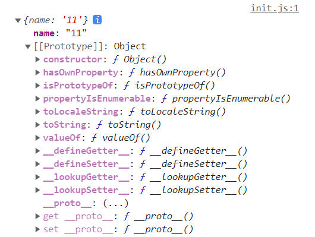
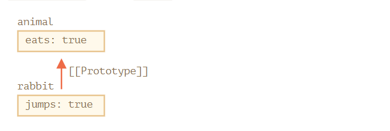

### 原型[[Prototype]]

JavaScript 中 对象处理 明面上 定义的熟悉，还有个特殊的隐藏属性`[[Prototype]]`，它要么为 `null`，要么为 对另一个对象的引用，该对象被称为**原型**



### [[Prototype]]设置方式

#### 使用特殊的名字 `_proto_`

例如

```js
let animal = {
  eats: true
};
let rabbit = {
  jumps: true
};

rabbit.__proto__ = animal; // 设置 rabbit.[[Prototype]] = animal
```

现在，我们要从`rabbit`读取一个它没有的属性， JavaScript 会自动从 `animal`中获取

```js
let animal = {
  eats: true
};
let rabbit = {
  jumps: true
};

rabbit.__proto__ = animal; // (*)

// 现在这两个属性我们都能在 rabbit 中找到：
alert( rabbit.eats ); // true (**)
alert( rabbit.jumps ); // true
```

我们可以这样理解

1. 在 `(*)`这行中，我们设置了 `animal` 为 `rabbit` 的原型
2. 当 alert 试图读取 `rabbit.eats`  `(**)`时，因为它不存在 `rabbit` 中，所以 JavaScript会顺着 `[[Prototype]]`引用，在 `animal` 中查找（自下而上）
   

在这里，我们可以说：

- animal 是 rabbit 的原型
- 或者说， rabbit 对的 原型是从 animal 继承而来的

> 因此，如果 animal 有许多的属性和方法，那么他们自动地变为 在 rabbit 中可用，这种属性被称为 **继承**

### 原型说明

- 由原型组构成的叫原型链

- 原型链可很长，通过 `_proto_`可以设置原型链，`object`默认原型链是 Object 对象
- 原型链设置不能形成闭环，否则 JavaScript 会抛出错误
- `_proto_`的值可以是对象 ，也可以是 `null`，其他的属性会被忽略
